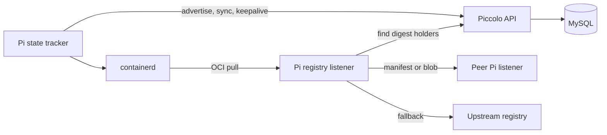

# Piccolo

[](https://github.com/laixintao/piccolo/actions/workflows/ci.yml)
[](go.mod)
[](LICENSE)

Piccolo is a peer-to-peer OCI image distribution service for containerd nodes. It lets a node reuse image manifests and blobs already present on nearby nodes before falling back to the upstream registry.

Piccolo has two components:

- **Piccolo** is the central discovery API. It stores which Pi nodes have each image digest or tag.
- **Pi** runs beside containerd. It tracks local images, advertises them to Piccolo, serves local content to peers, and exposes a registry mirror endpoint to containerd.

> Piccolo is currently a `v0.x` project. Test it in a non-production environment first. Authentication and TLS termination are expected to be provided by your network or an external proxy.

## Why Piccolo?

- Reduce repeated image downloads across a cluster.
- Keep serving cached image content when an upstream registry is slow.
- Group nodes so discovery stays within a region, availability zone, or environment.
- Expose Prometheus metrics, health endpoints, and optional pprof diagnostics.
- Read blobs directly from containerd's content store for efficient peer uploads.

## Architecture



The data plane stays between Pi nodes. Piccolo stores discovery metadata only; it does not store image layers.

## Requirements

- Linux nodes using containerd 1.x or newer.
- Go 1.24.1 or newer when building from source.
- MySQL 8.x for the discovery API.
- Docker Compose v2 for the optional local quick start.
- Network connectivity from every Pi node to Piccolo and between Pi peer listeners.

## Quick start

### 1. Start Piccolo and MySQL

For a local evaluation, Docker Compose creates MySQL, migrates the schema, and starts Piccolo:

```bash
docker compose -f deploy/docker-compose.yml up --build -d
curl --fail http://127.0.0.1:7789/healthz
```

This compose file is for development only. It uses example credentials and publishes an unauthenticated API.

### 2. Build Pi

```bash
make build-pi
./bin/pi --version
```

### 3. Run Pi on a containerd node

The process needs permission to connect to the containerd socket and read its content store:

```bash
sudo ./bin/pi \
  --registry-listen-addr 127.0.0.1:5000 \
  --pi-listen-addr 10.0.0.12:5001 \
  --metrics-listen-addr 127.0.0.1:9090 \
  --registries https://docker.io \
  --piccolo-api http://10.0.0.10:7789 \
  --group default
```

`--pi-listen-addr` must be reachable by other Pi nodes. The registry listener can remain on loopback when only the local containerd uses it.

### 4. Point containerd at Pi

Ensure containerd has a registry `config_path`, commonly in `/etc/containerd/config.toml`:

```toml
[plugins."io.containerd.grpc.v1.cri".registry]
  config_path = "/etc/containerd/certs.d"
```

Then create `/etc/containerd/certs.d/docker.io/hosts.toml`:

```toml
server = "https://registry-1.docker.io"

[host."http://127.0.0.1:5000"]
  capabilities = ["pull", "resolve"]
```

Restart containerd if your installation requires it, then pull an image normally:

```bash
sudo ctr --namespace k8s.io images pull docker.io/library/alpine:latest
```

Repeat the Pi deployment on at least two nodes to exercise peer-to-peer transfers.

## Build and test

```bash
make help
make build       # bin/pi and bin/piccolo
make check       # go vet and race-enabled tests
```

To build containers:

```bash
docker build -t piccolo:dev .
docker build -f Pi.Dockerfile -t piccolo-pi:dev .
```

Version metadata can be supplied to Docker builds with `--build-arg VERSION=...`, `COMMIT=...`, and `DATE=...`.

## Running Piccolo manually

Create or migrate the schema first:

```bash
./bin/piccolo migrate-db \
  'piccolo:secret@tcp(127.0.0.1:3306)/piccolo?charset=utf8mb4&parseTime=True&loc=Local'
```

Start the API using the `<group>:<role>:<dsn>` format:

```bash
./bin/piccolo server \
  --piccolo-address 0.0.0.0:7789 \
  --db-dsn-list \
  'default:master:piccolo:secret@tcp(127.0.0.1:3306)/piccolo?charset=utf8mb4&parseTime=True&loc=Local' \
  --enable-evictor
```

For compatibility with older releases, `server` may be omitted when server flags are passed directly. New deployments should keep the explicit subcommand for clarity.

Repeat `--db-dsn-list` to configure additional master, replica, or group DSNs. A `default:master` entry is always required.

## Configuration

Every CLI option also has an environment-variable equivalent. Run either binary with `--help` for the complete, authoritative list.

Important Pi settings:

| Option | Environment | Default | Purpose |
| --- | --- | --- | --- |
| `--containerd-sock` | `CONTAINERD_SOCK` | `/run/containerd/containerd.sock` | containerd gRPC socket |
| `--containerd-namespace` | `CONTAINERD_NAMESPACE` | `k8s.io` | image namespace |
| `--containerd-content-path` | `CONTAINERD_CONTENT_PATH` | containerd's standard content path | direct blob storage path |
| `--full-refresh-minutes` | `PI_REFRESH_MINUTES` | `60` | full state reconciliation interval |
| `--max-upload-connections` | `MAX_UPLOAD_CONNECTIONS` | `5` | concurrent peer blob transfers |
| `--max-upload-blob-bytes-per-second` | `PI_MAX_UPLOAD_BLOB_BYTES_PER_SECOND` | `1073741824` | aggregate upload limiter |
| `--mirror-resolve-timeout` | `MIRROR_RESOLVE_TIMEOUT` | `2s` | per-peer discovery timeout |
| `--mirror-resolve-retries` | `MIRROR_RESOLVE_RETRIES` | `3` | peer attempts before fallback |

Both binaries disable pprof by default. Enable it only on a protected listener with `--enable-pprof` or `ENABLE_PPROF=true`.

## HTTP endpoints

Piccolo exposes:

| Endpoint | Method | Description |
| --- | --- | --- |
| `/healthz` | `GET` | process health |
| `/metrics` | `GET` | Prometheus metrics |
| `/api/v1/keepalive` | `POST` | refresh a Pi lease |
| `/api/v1/distribution/advertise` | `POST` | add keys held by a Pi |
| `/api/v1/distribution/sync` | `POST` | reconcile all keys for a Pi |
| `/api/v1/distribution/findkey` | `GET` | find peers holding a key |

Pi exposes `/v2/...` OCI endpoints on both listeners, `/healthz` on the peer listener, and `/metrics` on the metrics listener. See [docs/api.md](docs/api.md) for request examples and response formats.

## Operations and security

- Restrict the Piccolo API and Pi peer ports to trusted networks. The project does not currently implement authentication.
- Terminate TLS at a reverse proxy or service mesh if traffic crosses an untrusted network.
- Do not expose pprof publicly; profiles can contain operationally sensitive data.
- Monitor `/metrics`, and use `/healthz` for liveness checks.
- Enable the Piccolo evictor so records from nodes missing keepalives are removed.
- Back up MySQL using your normal database procedure. Image data remains in containerd and is not part of the Piccolo database.

See [SECURITY.md](SECURITY.md) for private vulnerability reporting.

## Project documentation

- [Architecture and request flow](docs/architecture.md)
- [HTTP API examples](docs/api.md)
- [Contributing guide](CONTRIBUTING.md)
- [Security policy](SECURITY.md)
- [Changelog](CHANGELOG.md)

## License

Piccolo is licensed under the [Apache License 2.0](LICENSE).
